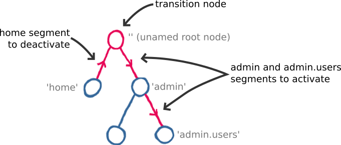
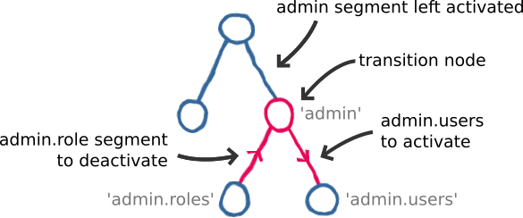
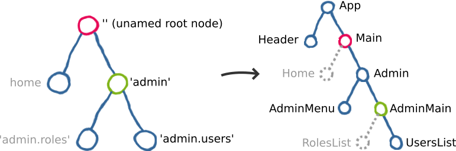

# Core Concepts

The main idea behind router5 is to treat routes like any other application data / state. This guide aims to take you through router5's key concepts.

In "traditional" routing, a specific route is associated with a _route handler_. Such handlers would return your application tree or would link your route to a specific view / component. With router5 it is reversed: rather than the router updating the view, it is up to the view to listen / bind / subscribe to route changes in order to update itself.


https://www.youtube.com/watch?v=hblXdstrAg0


## The state

[router5](https://github.com/router5/router5) is the core repository. Once you have defined your routes and started your router, it only does one thing: it takes navigation instructions and output state updates.

Updating your browser history or listening to URL changes is considered a side-effect, because they are specific to an environment where your application might run (the browser). You can use the browser plugin to update the browser URL and translate popstate events to routing instructions.

A state object will contain:
- The `name` of the route
- The parameters (`params`) of the route
- The `path` of the route

### Tree of routes

Your routes are organised in a tree, made of segments and nodes. At the top will always be an unnamed root node (its name is an empty string `''`). It gives you the ability to have nested routes, each node of the tree (except the root node) is a valid route of your application.

For the rest of this article, we will use the following simple example of a few nested routes:

### Transition

During a transition phase, the router will follow a __transition path__: it will deactivate some segments and activate some new ones. The intersection node between deactivated and activated segments is the __transition node__. The __transition node__ is very important for your view, as we are about to discover.

Using the tree of routes shown above, let's consider we transition from `home` to `admin.users`: the transition node will be _the unamed root node_, we will deactivate `home` and activate `admin` and `admin.users`.

Now let's see another example: a transition from `admin.roles` to `admin.users`. The transition node will be `admin`, and the admin segment will remain activated. `admin.roles` will be deactivated and `admin.users` will be activated.

## The view

> The router is unaware of your view and you need to bind your view to your router's state updates.

This is where you need to forget about route handlers and linking routes to components. On the left you have state updates coming from your router, and on the right you have your application view. Your application view is already in a certain state, and will now have to update to reflect the latest state updates.

On a route change, you only need to re-render a portion of your app. Depending on where you come from, for the same given route, a smaller or larger part of your application view will need to be re-rendered. This is why route handlers are not helpful: routing is not about mapping a route to a component, it is about going from A to B.

### Binding to route changes

Your view will need to subscribe to route updates, or specific route updates. There are three types of events you might want to react to, depending on what information you are after:

- The router has navigated to a route (any route)
- The router has navigated to a specified route
- A specified node is the transition node

The last point is the main one. We have seen your routes are organised in a tree. Your components are also organised in a tree, like DOM elements of a page are. In your application, each route node (when active) will have a corresponding component node. Those components should be re-rendered if their associated node is a transition node of a route change.

Below is an example of associated route and component nodes, when `admin.users` is active:

The current route is `admin.users`. If we were to navigate to `home`, `Main` would be the component associated to the route node `''`. It would re-render to output a `Home` component instance rather than an `Admin` one, discarding the whole admin view.

> The __transition node__ (as explained above), _is_ the node to re-render your view from.

In slightly more complicated cases, you might have other parts of your screen to re-render. For example, you might have a header, a main menu or a side panel to update on a route change: in that case you can listen to any route change or a specific route change, and re-render that specific portion of a screen. Keep transition nodes for your "main" content update.
